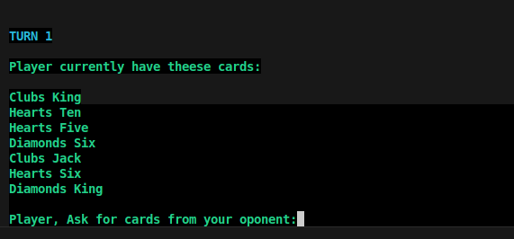
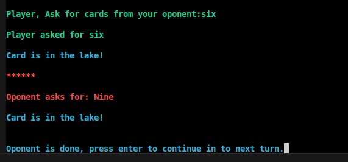
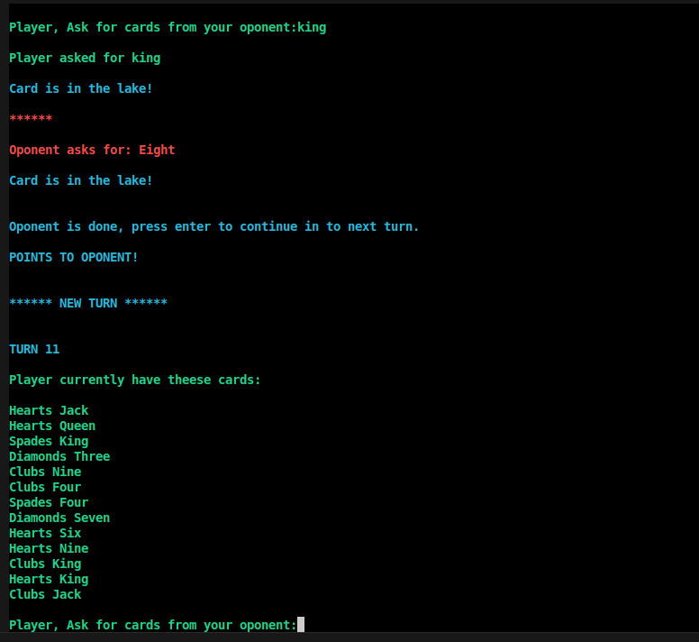
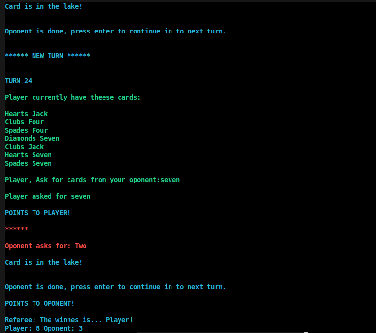

## In the Lake
This is a Swedish card game for children.

Rules in swedish: https://www.spelregler.org/finns-i-sjon/

To start the game, just run `main.py` by typing

`$ python3 main.py`

And the game will be run in the terminal, it may for example look something like this:

Type what kind of card you would like to get from your oponent, for example `six` and enter.

Since the oponent did not have a six, it will be in the lake.

Press enter to continue.

... And the game will continue like that until someone wins.

### Have fun playing!

